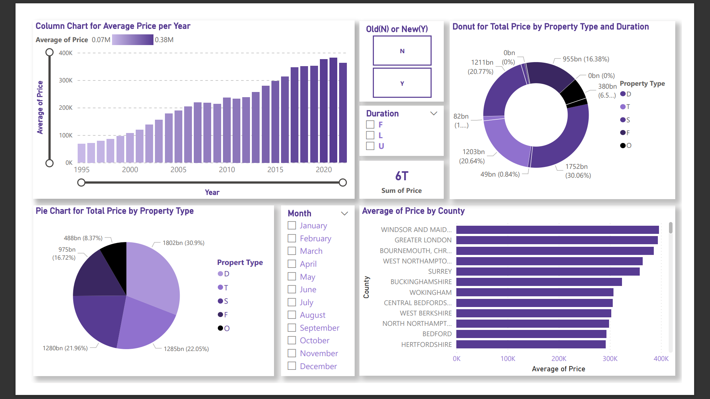
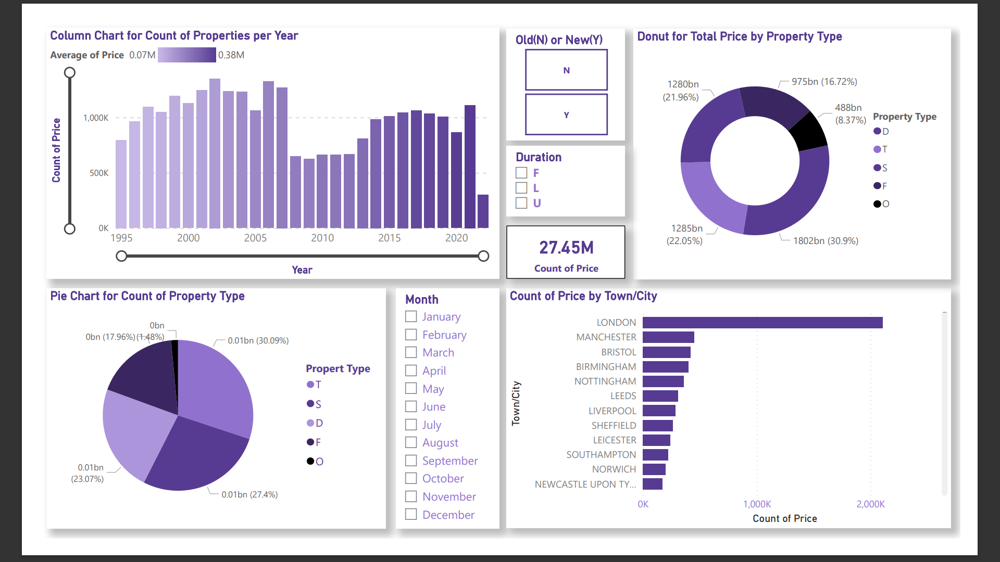

# UK Housing Prices: Data Analysis, Visualization & Prediction

An end-to-end Big Data Analytics and Machine Learning project focused on processing, analyzing, and predicting property transaction trends in England and Wales using cloud infrastructure and modern Business Intelligence tools.

---

## 📌 Project Overview
This project processes the complete **Price Paid Data** provided by **His Majesty's (HM) Land Registry**, covering over **27 million records** (approx. 2.8 GB) of full-market value property sales from 1995 onwards. Due to the scale of the dataset, processing and analytics were offloaded to a distributed cloud computing cluster, followed by interactive visual engineering and predictive modeling.

### 👥 Project Team (C-DAC Kharghar)
* **Ranjit Kailasrao More**
* **Prathmesh Shivaji Dalve**
* **Jayraj Shrikant Maghade**
* **Nayan Surendra Dhoble**
* **Sonali Ashok Waman**
* **Shivaraj Hiraman Shelar**
* **Project Guide:** Parag Thakur | **Course Co-ordinator:** Vineeta Singh

---

## 🛠️ Tech Stack & Architecture

* **Cloud Infrastructure (AWS):**
  * **Amazon S3:** Scalable object storage holding the raw 2.8 GB `.csv` data cluster.
  * **Amazon EC2:** Created a `t2.large` Windows Instance to ingest raw registry transactions via AWS CLI.
  * **Amazon EMR (Elastic MapReduce):** Provisioned a Hadoop cluster comprised of 1 Master Node (`m4.xlarge`) and 2 Slave Nodes (`m4.large`).
* **Big Data Frameworks:** Spark SQL, PySpark RDDs/DataFrames, and Apache Hive.
* **Business Intelligence:** Microsoft Power BI Desktop for data modeling and interactive dashboard tracking.
* **Machine Learning Environment:** AWS SageMaker running a Python Jupyter Lab notebook ecosystem.

---

## 🚀 Data Processing & Analytical Pipeline

### 1. Big Data Analytics (AWS EMR)
* **Spark SQL:** Tailored structural mappings using explicit schemas (`StructType`) to quickly answer key market vectors. Queries processed yearly averages, identifying **2021** as the peak historic transaction year with an average valuation of **£381.10K**.
* **PySpark:** Implemented distributed map-filtering mechanics via RDD arrays to isolate granular traits, proving established buildings are vastly favored over newly built ones (~24.6M vs ~2.8M sold).
* **Apache Hive:** Data tables were built externally over the distributed runtime directory using Hive Query Language (HQL) to aggregate structural features, tracking transactional changes across regional county lines.

### 2. Data Visualization (Power BI)
Interactive report boards were structured to split transaction parameters dynamically via cluster bar charts, donut matrices, geographical layers, and slicer tools:
* **Dashboard 1 (Price Paid Analytics):** Tracks valuation distributions. Insights confirmed **Greater London** controls the highest market capitalization, representing roughly **21% (£1.39 Trillion)** of the total real estate transaction value in the UK.
* **Dashboard 2 (Property Volume Metrics):** Highlights market frequency shifts over the timeline, noting historic peak purchase volumes occurring in **2002 (1.35 Million properties)**.

### 📊 Project Dashboards
*Note: High-quality representations of the dashboards are embedded below. If you want to explore the interactive files, see the external links in the replication section.*





### 3. Machine Learning (AWS SageMaker)
* Conducted advanced Exploratory Data Analysis (EDA) and data pre-processing within SageMaker cluster pipelines.
* Built Machine Learning algorithms—specifically **Linear Regression** and **Decision Tree Regressor**—on localized sub-samples (5 Million rows) to predict future price actions and optimize valuation models. 
* Due to extreme variance in a 27-million-row macro environment, the Decision Tree model achieved a baseline operational accuracy of **~60%**.

---

## 📈 Key Insights Summary
* **Regional Dominance:** Greater London remains the absolute hub of UK real estate capital, ahead of Westminster and Kensington/Chelsea.
* **Property Preferences:** Terraced properties represent the highest volume class in the UK (8.2 Million transactions), followed closely by Semi-Detached models. Freehold tenure remains significantly more popular than leasehold options.
* **Temporal Patterns:** June and August consistently manifest as seasonal high-volume entry months for annual house transactions across decades.

---

## 🛠️ How to Replicate and Run Locally

1. **Dataset Ingestion:**
   Due to GitHub's file storage limits, the raw 2.8 GB dataset is omitted from this repository. You can access and download the raw transactional source files directly from the [HM Land Registry Price Paid Data Portal](https://www.gov.uk/government/statistical-data-sets/price-paid-data-downloads).

2. **Power BI Project File (.pbix):**
   The compiled dashboard source file is roughly 800 MB, exceeding GitHub's 100 MB upload threshold. You can request access or download the active dashboard project here:
   * 🔗 [Download Power BI (.pbix) File via Google Drive](https://drive.google.com/file/d/1LwCwraZvMj_4Zj4VcCfDxGZWmiKJQ5z3/view?usp=drive_link)

3. **Explore ML & Code Notebooks:**
   Open the `notebooks/` directory right here on GitHub to instantly see the fully executed Jupyter Notebook, complete with data visualizations, processing steps, and model metrics.
"""

## 📂 Repository Structure
```text
├── notebooks/            # Jupyter Notebooks containing SageMaker EDA & ML models
├── dashboards/           # Power BI dashboard screenshots (.png formats)
└── docs/                 # Detailed project dissertation report (PDF)
